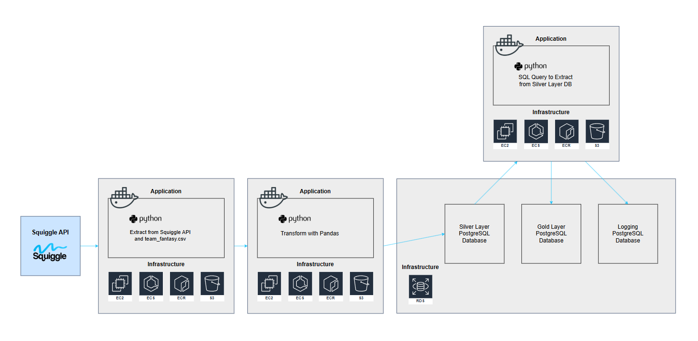
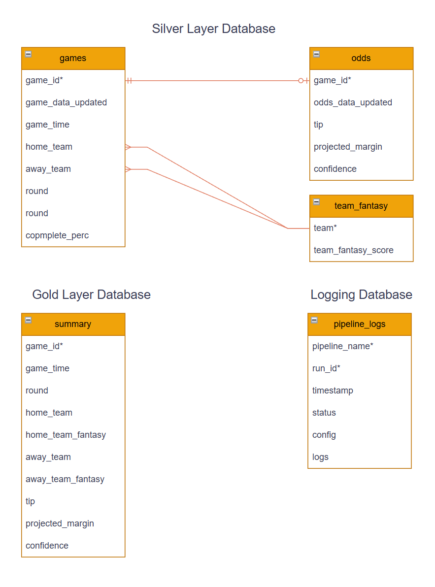
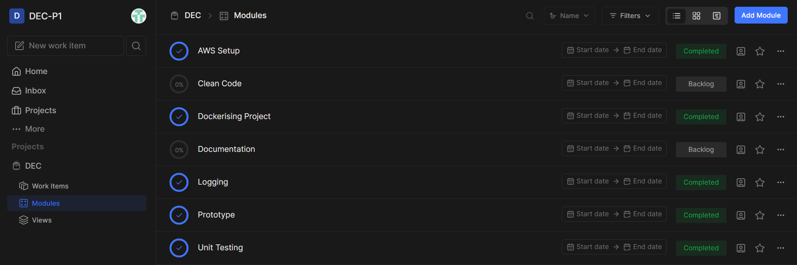

# Project Overview 

An ETL pipeline for Australian Rules Football (AFL) games data. The result is an aggregated view of game details, betting odds and the team's overall AFL Fantasy Score.

## Objective

Provide a user with a summarised view of game details to assist in making their AFL game tips for the round. The user is assumed to be in a tipping competition where you gain points with each correct tip.

## Usage

### Pipeline configuration
`afl_games\run.yaml` allows you to edit settings per pipeline. Each `name` is a new pipeline and `config` contains pipeline specific settings.

```
name: afl_games
    config: 
        log_folder_path: "./main/logs"
        player_rankings_path: "./main/data/raw/2024-r24-player_rankings.csv"
        sql_extract_path: "./main/assets/sql/extract"
        games_load_method: "upsert"
        odds_load_method: "overwrite"
        tf_load_method: "upsert"
        summary_load_method: "overwrite"
```

### Environment variables
To run, a number of environment variable need to be set. These can be added to the `template.env`, or if you are using a cloud service provider they can be set there.

## Source datasets

- [Squiggle](https://api.squiggle.com.au/) is a RESTful API that allows for various queries related to AFL games. The queries used for this project are "games" and "tips" (tips will referred to as odds going forward). Squiggle allows you to specify what season, what round and what team you are querying for. Squiggle doesn't require an API key but does require you specify your email address in the User-Agent header.

- [Footywire](https://www.footywire.com/) is an AFL statistics website that does not offer a RESTful API. For this reason, individual player fantasy data has been provided in a CSV.

## Solution architecture
The default implementation of this project is a Docker image deployed to Amazon Web Services (AWS).

- **Squiggle API** for game data and odds data.
- **Docker image** containing python code and the *player fantasy data* CSV.
- **ECR** to store the Docker image.
    {provide screenshot of ECR}
- **ECS** to run the Docker image. This uses an **EC2** instance as the infrastructure.
    {provide screenshot of ECR}
- **S3** to store a `.env` file containing environment variables.
    {provide screenshot of ECR}
- **RDS** to run a PostgreSQL database instance.
    {provide screenshot of ECR}



### Entity Relationship Diagram



## Pipeline steps (E-T-L-E-T)

### Extract

**Data: games**
- Extract from Squiggle API, specifying this season only (incremental extract).

**Data: odds**
- Identify most recent incomplete game to then identify the current round.
- Extract from Squiggle API, specifying this season and this round (incremental extract).

**Data: team_fantasy**
- Extract player fantasy ratings from Footywise CSV (full extract).

### Transform

**Data: games**
- Concatenate time and timezone of the game to a single column.
- Sort rows by `unixtime`.
- Select a subset of columns.
- Cast `id`, `round` and `complete` as numeric types.
- Rename colmuns:
    ```
    {
        "id": "game_id",
        "updated": "game_data_updated",
        "localtime": "game_time",
        "hteam": "home_team",
        "ateam": "away_team",
        "complete": "complete_perc"
    }
    ```

**Data: odds**
- Select a subset of columns.
- Cast `gameid`, `margin` and `confidence` as numeric types.
- Rename columns:
    ```
    {
        "gameid": "game_id",
        "updated": "odds_data_updated",
        "margin": "projected_margin"
    }
    ```
**Data: team_fantasy**
- A mapping function is applied to the `teams` column to team names in this dataset to match Squiggle team names.
- Individual players are grouped by team.
- Cast `Score` as a numeric type.
- Sort rows by `Score`.
- Rename columns:
    ```
    {
        "Team": "team",
        "Score": "team_fantasy_score",
    }
    ```

### Load

**Table: games**
- Load table to PostgreSQL `silver` database (upsert).

**Table: odds**
- Load table to PostgreSQL `silver` database (upsert).

**Table: team_fantasy**
- Load table to PostgreSQL `silver` database  (upsert).

### Extract

**Data: summary**
- Extract from `silver` database a summary table.
- `games` and `odds` tables are joined based on `game_id` to `game_id` and `team_fantasy` is joined based on `home_team` to `team` and `away_team` to `team`.

### Load

**Table: summary**
- Load table to PostgreSQL `gold` database (overwrite).
- The `summary` table will be a view of games yet to be played of the current round, so it is important for irrelevant data to be removed.

**Table: pipline_logs**
- Load table to PostgreSQL `logging` database (insert).


## Breakdown of tasks

My project was broken down into blocks, based on the key requirements. These blocks became 'modules' on Plane.so as well as my Git branches. Within the Plane.so modules were tasks specific to each block. The blocks I indentified were:

1. A working prototype: this was the basic extract and transform of my data, mostly in one file.
2. Code Clean Up: introducing separate files, separate functions, separate classes and a YAML config.
3. Unit Tests: testing integration and function.
4. Logging: logging to console, a log file and finally a database.
5. Dockerising Project: create a docker image that can then be deployed.
6. Amazon Web Services (AWS) Set up: provision the infrastructure required to run my project on the cloud.
7. Documentation: document the purpose of the project and how it works (this was not a Git branch).



## What I learned

- **It is important to decide on the environent you will use**. This includes Python version and Python library versions. I was developing with a mix of two virtual environments that had different versions of Python and different versions of libraries. There had been fixes I had made to have both environments run the project locally but this created issues when creating a Docker image. Next time I will use a consistent develop environment with a requirements.txt from the start.
- **Its is important to have a `.gitignore` from the beginning**. I didn't realise until half way through that my `.env` was being pushed to Github, as well as the `__pychache__` folders. These had to be removed from my Git respository before adding them to a `.gitignore` otherwise they wouldn't actually be ignored. Next time I will at least start with the templated `.gitignore` via Github.
- **There are many ways to structure a project and it's important to plan**. I found myself changing the structural pattern of my project across files, folders, functions and classes and this was a result of starting to code before planning. By planning from the start I could've came up with a structural pattern that made sense - this would have saved me time.
- **Just because you have a type hint, that doesn't mean that is actually the case**. Although it wasn't causing any errors, I realised some of my docstrings and type annotations were indicating what I wanted the types to be, but this wasn't actually the case. Next time I will test my functions for input and output types earlier to ensure what I am documenting is correct.
